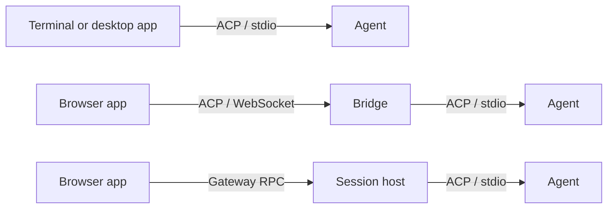

# effect-acp

**Agent sessions for Effect applications.**

Connect to coding agents, build streaming chat interfaces, or expose your own agent through the [Agent Client Protocol](https://agentclientprotocol.com). `effect-acp` brings ACP into Effect's services, schemas, streams, and scopes—from a local process to a browser application with retained sessions.

[](https://effect.website/)
[](package.json)
[](LICENSE)

[Get started](docs/tutorials/first-session.md) · [Connect to Claude or Codex](docs/how-to/real-agents.md) · [API reference](docs/reference/client.md) · [Documentation](docs/README.md)

## Why effect-acp?

- **A session API for your application.** Connect, create a session, submit a prompt, and read or observe its state.
- **Streaming state, ready for a UI.** Immutable snapshots collect messages, tool calls, plans, usage, and pending interactions. Subscribe to changes with Effect streams.
- **Permissions you control.** Present agent requests to the user and resolve them explicitly through the session handle.
- **Resources with an owner.** Processes, sockets, and subscriptions follow Effect scopes. Layers supply the transport and platform services.
- **Several ways to deploy.** Connect directly over stdio, relay ACP through a WebSocket bridge, or retain sessions on a server across browser disconnects.
- **Agent authoring included.** Define session and prompt handlers, emit updates, and serve your own agent over ACP.

## Install

```sh
bun add effect-acp effect@4.0.0
```

Or with npm:

```sh
npm install effect-acp effect@4.0.0
```

Built for **stable Effect 4**. Effect is a peer dependency; the examples are verified with `4.0.0`. For terminal applications, add the matching platform package:

```sh
# Bun
bun add @effect/platform-bun@4.0.0

# Node.js
npm install @effect/platform-node@4.0.0
```

Browser clients use web APIs and injected services. The package ships ESM JavaScript and TypeScript declarations, with explicit subpath exports.

## Your first session

The [first-session tutorial](docs/tutorials/first-session.md) includes a small echo agent you can run without an account, API key, or model download. Save its `echo-agent.ts` beside the following client, then run `bun first-session.ts`.

<!-- example: docs/examples/first-session.ts -->
```ts
import * as BunRuntime from "@effect/platform-bun/BunRuntime"
import * as BunServices from "@effect/platform-bun/BunServices"
import * as Console from "effect/Console"
import * as Effect from "effect/Effect"
import * as Layer from "effect/Layer"
import * as ChildProcess from "effect/process/ChildProcess"
import { AcpClient } from "effect-acp/AcpClient"
import * as AcpConnector from "effect-acp/AcpConnector"
import * as AcpLocalClient from "effect-acp/AcpLocalClient"
import * as Stdio from "effect-acp/transport/Stdio"

const ClientLive = AcpLocalClient.layer.pipe(
  Layer.provide(AcpConnector.layer(Stdio.layer(
    ChildProcess.make("bun", ["echo-agent.ts"], { forceKillAfter: "2 seconds" })
  ))),
  Layer.provide(BunServices.layer)
)

const program = Effect.gen(function*() {
  const client = yield* AcpClient
  const connection = yield* client.connect({
    versions: [2, 1],
    params: { info: { name: "first-session", version: "1.0.0" }, capabilities: {} },
    timeout: "10 seconds"
  })
  yield* Console.log(`Connected using ACP v${connection.capabilities.version}`)
  const session = yield* connection.newSession({ cwd: process.cwd() })
  const submission = yield* session.submit([{ type: "text", text: "Hello ACP" }])
  yield* submission.outcome
  const snapshot = yield* session.snapshot
  for (const message of snapshot.messages) {
    if (message.kind !== "agent") continue
    const text = message.content.flatMap((block) =>
      "text" in block && typeof block.text === "string" ? [block.text] : []
    ).join("")
    yield* Console.log(`Agent: ${text}`)
  }
  yield* Console.log(`Turn state: ${snapshot.foreground.state}`)
})

if (import.meta.main) {
  BunRuntime.runMain(Effect.scoped(program).pipe(Effect.provide(ClientLive)))
}
```

The result:

```text
Connected using ACP v2
Agent: Echo: Hello ACP
Turn state: idle
```

`submission.outcome` waits for the foreground turn to finish. The session retains its current snapshot; use `session.observe` to acquire a snapshot and the stream of changes that follows it. The [session UI guide](docs/how-to/session-ui.md) shows streaming updates and permission handling.

The example explicitly enables ACP v2 and v1. Connections default to **ACP v1**; the v2 draft is opt-in, with version-specific payloads validated by generated schemas.

## Choose where the session lives



| Deployment | Session lifetime | Start here |
| --- | --- | --- |
| **Direct client** | Your application scope owns the connection and agent process. | [Claude and Codex](docs/how-to/real-agents.md) |
| **WebSocket bridge** | The bridge relays ACP for the browser socket's lifetime. | [Browser bridge](docs/how-to/browser-bridge.md) |
| **Hosted sessions** | The server retains sessions across client disconnects, within its configured limits. | [Hosted sessions](docs/how-to/hosted-sessions.md) |

Hosted retention is in memory and bounded by the host's lifetime. Read the [ownership explanation](docs/explanation/ownership.md) for how connections, sessions, observers, and cancellation fit together.

## Build with the pieces you need

| API | Purpose |
| --- | --- |
| `AcpClient` | Connect to an agent and work with session handles. |
| `AcpApp` | Schemas and types for session snapshots, submissions, and interactions. |
| `AcpConnector` · `AcpTransport` | Open a fresh scoped transport for each connection. |
| `transport/Stdio` · `transport/WebSocket` · `transport/InMemory` | Compose process, socket, or in-memory connections. |
| `AcpAgent` · `agent/Store` | Define agent behavior and provide session storage. |
| `AcpHost` · `AcpGateway` · `AcpRemoteClient` | Host sessions and attach remote clients to retained state. |
| `protocol/v1` · `protocol/v2` | Use the generated protocol schemas directly. |

Import modules through `effect-acp/<module>`. Start with the session API; the lower-level connection and protocol modules are available when you need raw requests or a custom transport.

## Documentation

| I want to… | Guide |
| --- | --- |
| Run a complete example | [Your first agent session](docs/tutorials/first-session.md) |
| Connect to a coding agent | [Claude and Codex](docs/how-to/real-agents.md) |
| Render chat, tools, and permissions | [Build a session UI](docs/how-to/session-ui.md) |
| Connect a browser to a stdio agent | [Add a WebSocket bridge](docs/how-to/browser-bridge.md) |
| Keep sessions across disconnects | [Retain sessions on a host](docs/how-to/hosted-sessions.md) |
| Implement my own ACP agent | [Write an ACP agent](docs/how-to/write-agent.md) |
| Look up exact behavior | [Client](docs/reference/client.md) · [Transports](docs/reference/transports.md) · [Hosting](docs/reference/hosting.md) · [Protocol](docs/reference/protocol.md) · [Agents](docs/reference/agent.md) |

These guides assume TypeScript and basic Effect familiarity. ACP connects an application to an agent; MCP servers supply tools the agent can use within a session.

## Development

```sh
bun install
bun run check
bun run verify:package
```

The checks cover generated schemas, types, lint, documentation examples, tests, browser imports, and the packed package's public exports. For publishable changes, run `bun run changeset` and commit the generated changeset alongside your implementation.

[Development guide](docs/development.md) · [Publishing guide](docs/publishing.md) · [Architecture](ARCHITECTURE.md) · [Type audit](TYPE_AUDIT.md)

## License

[MIT](LICENSE) © Julia Ortiz
