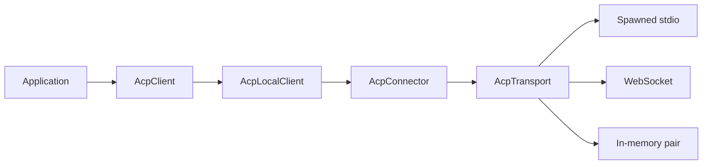
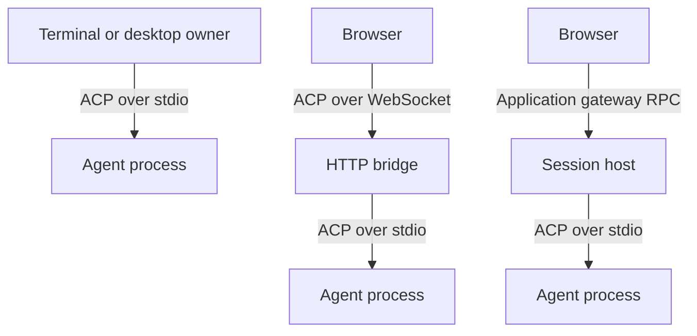

# Connections, sessions, and ownership

The lifetime of an agent session determines where an application can put it. A terminal client can own a process directly. A browser needs another process to launch it. A browser that may disappear while the agent keeps working needs a server that owns more than a socket relay.

`effect-acp` separates those lifetimes into services so the session API can remain familiar across deployment models.

## The service graph

`AcpTransport` is one live bidirectional channel carrying complete frames. `Stdio`, `WebSocket`, and `InMemory` provide different implementations of that service. The JSON-RPC peer can use any implementation without knowing how its I/O works.

`AcpConnector` is the factory boundary. It makes a fresh scoped transport for every connection, while keeping platform dependencies outside the protocol code. This distinction matters with Effect layers: a shared live transport and a shared factory that opens transports have different ownership semantics.

`AcpLocalClient` builds session runtimes on initialized JSON-RPC peers. It projects wire events into immutable state and exposes commands, rather than requiring every application to build its own transcript reducer and permission router.

## Three paths to an agent

The direct path's scope owns the agent process. Closing that scope tears down its resources. A retained TypeScript object does not keep a closed scope alive.

The bridge adds the second transport hop needed by a browser or renderer. It relays both directions: agent requests for permissions have to reach the client while prompts and updates flow the other way. Its lifetime is still the browser socket's lifetime. This is useful when the application wants connection-scoped agent work and the same ACP peer semantics across the network boundary.

The host owns the session independently of one browser socket. The browser talks to a package-owned application protocol, then receives session handles with the common API. A refresh detaches and reattaches a controller to retained state. The host decides which executable may launch, which workspace may access it, and which capabilities it implements.

A transparent bridge and a retained session host therefore solve different lifetime requirements. Making a socket reconnect cannot recreate an agent process's memory, pending interactions, or the outcome of an already-dispatched tool action.

## Observation is not ownership

A UI subscription is a view of a session. Disposing the subscription should not cancel a model turn. Interrupting a wait for a submission should likewise leave the session owner in control of that turn. That is why `observe`, `release`, `cancel`, `close`, and `delete` have different effects.

An observation combines a snapshot with the stream that follows it. Taking them separately would leave a gap in which updates could disappear from the view. Each subscriber has a finite delivery queue; if it falls behind, it reacquires a fresh boundary. Slow rendering does not grow a transcript without bound or silently pretend no update was lost.

Snapshots are bounded projections. Truncation markers distinguish an incomplete retained view from a complete conversation. Agent-owned IDs are retained where the protocol supplies them; v1 synthesized IDs describe the local projection and cannot carry v2 identity guarantees.

## Three acknowledgements mean different things

A transport accepting a frame, an agent inserting a user message, and an agent finishing a turn are separate events. v2 exposes insertion acknowledgement and foreground completion separately. v1's prompt response reports the turn's end and cannot supply a truthful insertion acknowledgement.

The common `Submission` handle preserves that distinction. `accepted` is unavailable on v1, while `outcome` follows each version's completion signal. An idle session means foreground work ended; a refusal or cancelled turn can also be idle.

Hosting adds another acknowledgement: the host may accept a command into its ledger before the agent answers it. A lost browser response then has a recoverable operation ID. A lost agent response is harder: the action may have occurred, but the host cannot know its result. Reporting an uncertain outcome avoids duplicating work through an automatic retry.

## Schemas connect the layers

Wire payloads arrive as data from another process. Gateway commands arrive from another application runtime. Recovery values arrive from storage. Effect schemas validate each boundary and keep invalid data in the error channel.

The schemas are related but serve different contracts. Protocol schemas describe ACP; snapshot schemas describe the application's projected state; gateway schemas describe ownership, operation admission, and recovery. Reusing Effect's schema and service abstractions across these layers makes composition consistent without pretending those contracts are identical.

Agent-side storage and host-side retention are also independent. A host can keep a live process across browser disconnects without storing anything durably. An agent may support persistence and resume across its own restart, but that requires explicit store and protocol behavior. The current host's in-memory epochs and retry windows deliberately bound what it can recover.

For the practical compositions, see [the bridge guide](../how-to/browser-bridge.md) and [hosted sessions](../how-to/hosted-sessions.md). The [client reference](../reference/client.md) gives exact operation behavior.
